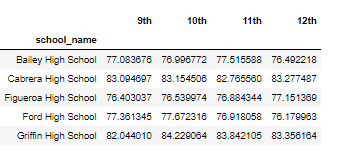
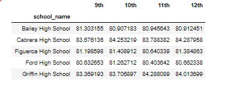
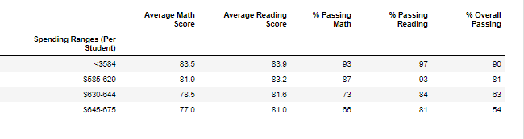
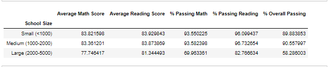
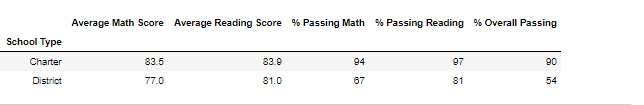

# School_District_Analysis

School District Analysis using Anaconda, Jupyter Notebook, Pandas & Python.

You can find the code [here.](/PyCitySchools_Challenge.ipynb)

## Overview of the school district analysis

 1- Data

 In this project we were given access to both [school_complete](/Resources/schools_complete.csv) and [student_complete](/Resources/students_complete.csv) data to perform an analysis regarding every student's math and reading scores, as well as various information on the schools they attend. And help to make a strategic decision regarding the future shcool budget and priorities.
 
 2- Purpose of the project
 
The purpose of the project is analyse the following data of the High Schools before and after a possible academic dishonesty, where the data for 9th Grade of Thomas High School has been upheld for the analysis purpose. We have replaced the math and reading scores for Thomas High School with NaNs while keeping the rest of the data intact. We will analyse the data before and after making this change.

First, our responsability is to aggregate data and showcase obvious trends in school performance. Our final report should include each of the following (deliverable 2):

 - The district summary.
 - The school summary.
 - The top 5 and bottom 5 performing schools, based on the overall passing rate.
 - The average math score for each grade level from each school.
 - The average reading score for each grade level from each school.
 - The scores by school spending per student, by school size, and by school type.
 
## Results

 1- Deliverable 1:
 
 In the deliverable 1, we were assigned to select the ninth-grade reading and math scores for Thomas High School, by using the Pandas NumPy module to change the reading and math scores to NaN, which represents a "Not-a-Number" value, using the Pandas loc method with conditional statements and comparison and logical operators.
  
  After running the code we had the following results.
  
  
  
  
  
   1- Deliverable 2:
   
In the deliverable 2, we were assigned to repeat the school district analysis already done in this module, and to recreate the following metrics:
    
  1-1 The district summary.
  
  1-2 The school summary.
  
  1-3 The top 5 and bottom 5 performing schools, based on the overall passing rate.
  
  1-4 The average math score for each grade level from each school.
  
  1-5 The average reading score for each grade level from each school.
  
  1-6 The scores by school spending per student, by school size, and by school type.
   
   *1-1 The district summary*
   
   
   
   
 It gives the district's key metrics, including:

- Total Schools
- Total Students 
- Total Budget 
- Average Math Score  
- Average Reading Score
- % Passing Math (The percentage of students that passed math.) 
- % Passing Reading (The percentage of students that passed reading.)
- % Overall Passing (The percentage of students that passed math and reading.)

And since some of the test scores from the 9th grade at Thomas High School are missing we want to take all of the scores from the high school so that it doesn't affect our overall numbers.
   
   *1-2 The school summary*
   
   
   
   
 It creates an overview table that summarizes key metrics about each school, including:

- School Name 
- School Type 
- Total Students 
- Total School Budget
- Per Student Budget 
- Average Math Score 
- Average Reading Score 
- % Passing Math (The percentage of students that passed math.) 
- % Passing Reading (The percentage of students that passed reading.) 
- % Overall Passing (The percentage of students that passed math and reading.)

    *1-3 The top 5 and bottom 5 performing schools, based on the overall passing rate*
    
     
    
   
    *1-4 The average math score for each grade level from each school*

   
   
 
 
  *1-5 The average reading score for each grade level from each school*
  
   
   
   
   *1-6 The scores by school spending per student, by school size, and by school type*
   
     a- By school spending per student
   
   
   
   
    b- By school size
    
    
    
     c- By school type
     
     
    
   
   
