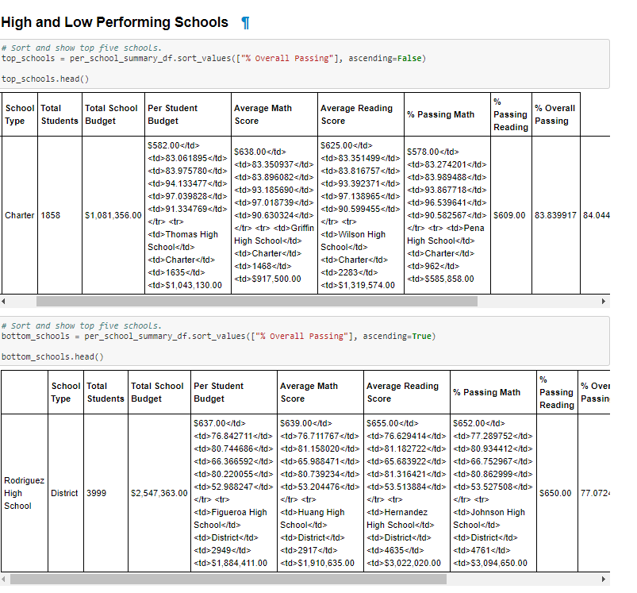

# School_District_Analysis

School District Analysis using Anaconda, Jupyter Notebook, Pandas & Python.

You can find the code [here.](/PyCitySchools_Challenge.ipynb)

## Overview of the school district analysis

 1- Data

 In this project we were given access to both [school_complete](/Resources/schools_complete.csv) and [student_complete](/Resources/students_complete.csv) data to perform an analysis regarding every student's math and reading scores, as well as various information on the schools they attend. And help to make a strategic decision regarding the future shcool budget and priorities.
 
 2- Purpose of the project
 
The purpose of the project is analyse the following data of the High Schools before and after a possible academic dishonesty, where the data for 9th Grade of Thomas High School has been upheld for the analysis purpose. We have replaced the math and reading scores for Thomas High School with NaNs while keeping the rest of the data intact. We will analyse the data before and after making this change.

First, our responsability is to aggregate data and showcase obvious trends in school performance. Our final report should include each of the following (deliverable 2):

 - The district summary.
 - The school summary.
 - The top 5 and bottom 5 performing schools, based on the overall passing rate.
 - The average math score for each grade level from each school.
 - The average reading score for each grade level from each school.
 - The scores by school spending per student, by school size, and by school type.
 
## Results

 1- Deliverable 1:
 
 In the deliverable 1, we were assigned to select the ninth-grade reading and math scores for Thomas High School, by using the Pandas NumPy module to change the reading and math scores to NaN, which represents a "Not-a-Number" value, using the Pandas loc method with conditional statements and comparison and logical operators.
  
  After running the code we had the following results.
  
  
  
  
  
   1- Deliverable 2:
   
In the deliverable 2, we were assigned to repeat the school district analysis already done in this module, and to recreate the following metrics:
    
  1-1 The district summary.
  
  1-2 The school summary.
  
  1-3 The top 5 and bottom 5 performing schools, based on the overall passing rate.
  
  1-4 The average math score for each grade level from each school.
  
  1-5 The average reading score for each grade level from each school.
  
  1-6 The scores by school spending per student, by school size, and by school type.
   
   *1-1 The district summary*
   
   
   
   
 It gives the district's key metrics, including:

- Total Schools
- Total Students 
- Total Budget 
- Average Math Score  
- Average Reading Score
- % Passing Math (The percentage of students that passed math.) 
- % Passing Reading (The percentage of students that passed reading.)
- % Overall Passing (The percentage of students that passed math and reading.)

And since some of the test scores from the 9th grade at Thomas High School are missing we want to take all of the scores from the high school so that it doesn't affect our overall numbers.
   
   *1-2 The school summary*
   
   
   
   
 It creates an overview table that summarizes key metrics about each school, including:

- School Name 
- School Type 
- Total Students 
- Total School Budget
- Per Student Budget 
- Average Math Score 
- Average Reading Score 
- % Passing Math (The percentage of students that passed math.) 
- % Passing Reading (The percentage of students that passed reading.) 
- % Overall Passing (The percentage of students that passed math and reading.)

    *1-3 The top 5 and bottom 5 performing schools, based on the overall passing rate*
    
     
    
   
    *1-4 The average math score for each grade level from each school*

   
   
 
 
  *1-5 The average reading score for each grade level from each school*
  
   
   
   
   *1-6 The scores by school spending per student, by school size, and by school type*
   
     a- By school spending per student
   
   
   
   
    b- By school size
    
    
    
     c- By school type
     
     
    
   ## Analysis and challenges
   
  1. How is the district summary affected?
   
   If we compare the results from PyCitySchools and PyCitySchools_Challenge, we can see a slight difference in the results: 1% drop avg math score between two analysis, while the average reading score stayed the same.
       
  2. How is the school summary affected?

The only change is within Thomas High Schools statistics as both math and reading scores drop. The over all passing for Thomas High School was 90.94% in pycityschools, with the 9th graders taken out the overall passing shrinks by 0.3 %.

  3. How does replacing the ninth graders’ math and reading scores affect Thomas High School’s performance relative to the other schools?

Thomas High School's performance decreased compared to the other schools however, it is not one of the lowest performing schools.

  4. How does replacing the ninth-grade scores affect the following: 
 
-- Math and reading scores by grade

 The 9th grade scores were brought down as Thomas High School 9th graders averaged higher than other schools.

-- Scores by school spending

The numbers stay nearly identical since the 9th graders are nullified from the statistics.
In the cohort $630-644, % passing math, %passing reading and %overall passing have decreased after changing the grades to NaN.

-- Scores by school size

The 1000 to 2000 size schools saw a drop from 91% to 85% overall passing percentage.

-- Scores by school type

Scores by school type are not altered at all.
The charter type schools saw a drop from 90% to 87% overall passing percentage.

#Conclusion

  The four major changes that occured between the two analyses were:

 - Without the 9th graders' scores, Thomas High School is not as competitive with other charter schools.
 - Without Thomas High School, the overall 9th graders' scores fell.
 - Without the 9th graders' scores, the district summary changes much less than the Thomas High School.
 - While 9th graders at Thomas High School aren't their highest performers, they do balance out the school's scores compared to just looking at 10th-12th graders.
   
